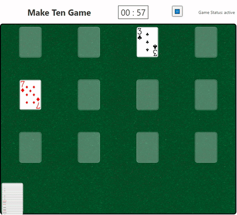

# Making Ten Card Game
> Simple interactive math game, built with Svelte (my first Svelte project)

# Go to the App!
You can access the game [here](https://make-ten-card-game.netlify.app/)!

## Installation
Nothing to install; published as a SPA at: [make-ten-card-game.netlify.app/](https://make-ten-card-game.netlify.app/)

## Usage Example

The goal of the game is pretty simple (this is geared towards elementary students). You want to combine cards from the top of the stacks to "make ten", over and over, until there are no cards left. Once an entire stack has been cleared, you can also move top cards into the empty spaces.

## Development
This is your fairly standard Svelte 3 + TypeScript project.

 - `yarn` to install dependencies
 - `yarn build` to create production HTML folder
 - `yarn dev` to serve with watcher (re-builds and serves on file changes)

<!-- ## Change Notes -->
